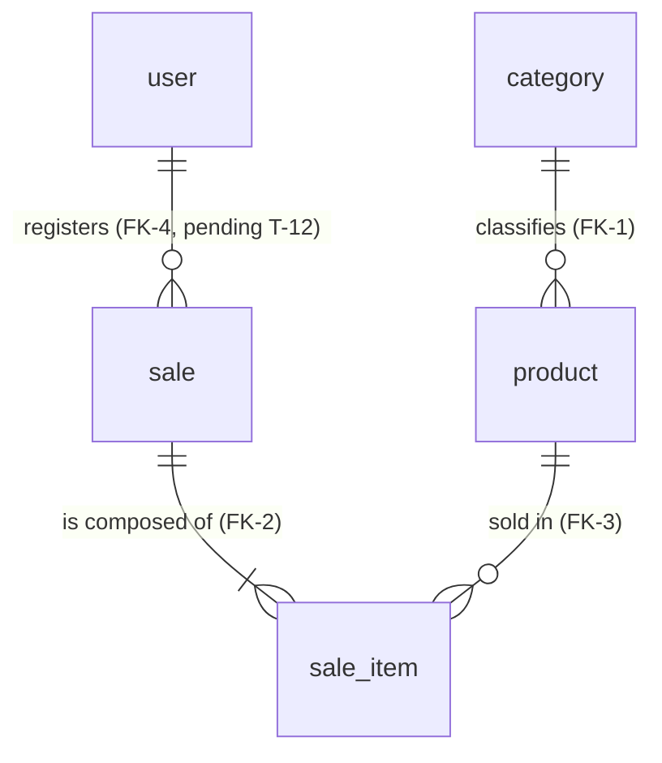

# Domain — Simple Stock Flow

> **Step 4 of 6.** Domain entities, rules and events, with their glossary.
> Source: [`spec/data-model.md`](../spec/data-model.md) (in Spanish; quotes are translated; §1 and §2 are its basis) · Product: [`03-product/product-vision.md`](../03-product/product-vision.md).
> **Citations:** `§n`, `FK-n`, `DP-nn`, `Qn`. **`[S-Dn]`** = assumption (see [§7](#7-assumptions)).

## 1. Subdomains

The model groups the five entities into **three aggregates**, one per subdomain, plus a read model:

| Subdomain | Aggregate root | Contains | Citation |
|---|---|---|---|
| **Catalog** | `Product` | `Category` (reference) | §2.1, §2.2 |
| **Sales** | `Sale` | `SaleItem` | §2.3, §2.4 |
| **Identity** | `User` | — | §2.5 |
| **Reporting** | *(not an aggregate)* | Sales report, `DateRange` | §1, D-06 |

The physical schema `sales` groups the whole system; the `sale` table names the sales aggregate (§3).

## 2. Glossary (the project's single language)

Code and columns are in **English**; the business language is Spanish in the model (§1). Both are given here.

| Term | Definition | Technical |
|---|---|---|
| **Product** (*Producto*) | Catalog item: name, price, stock, category and optional image, **and nothing else** (DP-03) | `Product` |
| **Category** (*Categoría*) | Classification of a product. A fixed set of **five**, seeded, with no maintenance | `Category` |
| **Price** (*Precio*) | Current value of the product. Strictly positive, two decimals | `Money` |
| **Stock** | Units available. Never negative | `product.stock` |
| **Product image** (*Imagen*) | Opaque key of the external binary; absent = `NULL` | `product.image_key` |
| **Sale** (*Venta*) | Consummated, **immutable** commercial fact: who, when and what | `Sale` |
| **Sale line** (*Línea de venta*) | Row: product, quantity and **frozen price**. Does not exist outside its sale | `SaleItem` |
| **Quantity** (*Cantidad*) | Units sold in a line. Strictly positive | `Quantity` |
| **Total / Subtotal** | Sum of subtotals / price × quantity. **Computed, not stored** | `Sale.Total`, `SaleItem.Subtotal` |
| **User** (*Usuario*) | Internal operator who authenticates and registers sales. **There is no customer** | `User` |
| **Role** (*Rol*) | `admin` or `seller` | `user.role` |
| **Password hash** | Irreversible fingerprint of the password | `user.password_hash` |
| **Date range** | Report window; end ≥ start | `DateRange` |
| **Sales report** | Aggregation by product over a range. **Not persisted** | Read model |
| **Frozen value** | Copy of the value at the instant of the sale; does not follow the catalog | §1 |
| **Soft delete** (*Baja lógica*) | Retiring a product by marking it, without deleting it | `product.deleted_at` |

**Term the model discards:** *sale currency* (the system is single-currency, D-05) (§1).

## 3. Entities and value objects

| Element | Type | Identity | Notes | Citation |
|---|---|---|---|---|
| `Product` | Entity, root | `id` (uuid generated by the app) | Operations: `Rename`, `ChangePrice`, `Withdraw`, `Restock`, `SetCategory`, `AttachImage` | §2.2 |
| `Category` | Reference entity | `id` | Operation: `Rename`. Read-only repository | §2.1 |
| `Sale` | Entity, root | `id` | Operations: `AddItem`, `EnsureConfirmable`. Computed `Total` property | §2.3 |
| `SaleItem` | Internal entity | `id` | `internal` constructor; only `Sale.AddItem` | §2.4 |
| `User` | Entity, root | `id` | `NormalizeUsername`; `Roles.IsValid` | §2.5 |
| `Money` | Value object | — | Amount to 2 decimals, `AwayFromZero`; **admits 0** | §2.2 |
| `Quantity` | Value object | — | Strictly positive | §2.4 |
| `DateRange` | Value object (application) | — | End not before start | §1 |

Value objects **have no table**; they live in their owner's row (D-07, §2).

## 4. Domain rules

The **Where it is enforced** column uses the model's marks: *engine*, *domain only*, *pending*.

| ID | Rule | Where it is enforced | Citation |
|---|---|---|---|
| R-01 | A product's price is strictly positive | domain only · T-20 | §2.2 |
| R-02 | Stock is never negative | **engine** | §2.2, ADR-002 |
| R-03 | Withdrawing more stock than available fails | domain only | §2.2 |
| R-04 | Product name is mandatory, non-empty and stored trimmed | domain only (`NOT NULL` in engine) | §2.2 |
| R-05 | Every product has exactly one existing category | **engine** (FK-1) | §2.2, §5 |
| R-06 | A product is never physically deleted: soft delete | **engine** (`deleted_at`, global filter) | §2.2, ADR-003 |
| R-07 | No image is represented as `NULL`, never as an empty string | domain only | §2.2 |
| R-08 | A sale needs at least one line to be confirmed | domain only | §2.3 |
| R-09 | A product does not repeat within a sale | domain only and **engine** (unique index) | §2.3 |
| R-10 | Adding a line and withdrawing stock are a single operation | domain only | §2.3 |
| R-11 | A registered sale is immutable (no edit, no delete) | domain only (by absence of operation) | §2.3 |
| R-12 | The line freezes name, price and category name of its moment | domain only; `category_name` **engine/pending (T-11)** | §2.4 |
| R-13 | A line's quantity is strictly positive | domain only · T-20 | §2.4 |
| R-14 | A line does not exist outside its sale | **engine** (FK-2 + `sale_id NOT NULL`) | §2.4 |
| R-15 | Total and subtotal are computed, not stored | by design (no column) | §1 |
| R-16 | The product of a line exists and is not discontinued at sale time | **engine** (FK-3) + domain | §5, §13 |
| R-17 | The sale is attributed to an existing user | **pending** (FK-4, T-12) | §5 |
| R-18 | Username is unique, lowercase and trimmed | unique: **engine**; normalization: domain only · T-20 | §2.5 |
| R-19 | Role belongs to `{admin, seller}` | domain only · T-20 | §2.5 |
| R-20 | The domain never sees the clear-text password | by design (hash port) | §2.5, D-09 |
| R-21 | Who grants `admin`: nobody at runtime; deployment provisions it | policy in the API (outside the model) | §11 H-3, DP-04 |
| R-22 | Category has a unique, non-empty name; it is a fixed set of five | unique: **engine**; non-empty: domain only · T-20 | §2.1, §9.1 |
| R-23 | The system is single-currency | by design (no column) | D-05 |
| R-24 | The end of a date range is not before its start | domain only (application) | §1 |
| R-25 | The report groups by frozen values and is **not** broken down by seller | by design | §11.1, DP-02 |

## 5. Domain events

**The model declares no domain events.** What it does declare are **business facts** (the sale is "a consummated commercial fact", §1) and named operations. They are named here as events **[S-D1]**; none implies a message bus.

| Event (assumed) | Originates in | Business effect | Base citation |
|---|---|---|---|
| `ProductCreated` | Product creation | Exists in the catalog | §2.2 |
| `ProductPriceChanged` | `Product.ChangePrice` | Changes the current price; does not touch past sales | §2.2, §1 |
| `ProductRenamed` | `Product.Rename` | Same for the name | §2.2 |
| `ProductRecategorized` | `Product.SetCategory` | Future sales freeze the new label; the report shows several rows | §2.2, §11.1 |
| `StockReplenished` | `Product.Restock` | Stock increases | §2.2 |
| `StockWithdrawn` | `Product.Withdraw` (inside `Sale.AddItem`) | Stock decreases | §2.2, §2.3 |
| `ProductDiscontinued` | Soft delete (`deleted_at`) | Leaves searches and sales | §2.2, ADR-003 |
| `ProductImageChanged` | `Product.AttachImage` / removal | The previous binary is deleted after commit | §2.2, §7.1 |
| **`SaleRegistered`** | `Sale` confirmed | Consummated, immutable fact; feeds the report | §1, §2.3 |
| `UserRegistered` | User creation / start-up | New account with a role | §2.5, §9.2 |

## 6. Cross-cutting invariants

- **Crossings between aggregates are by identity**, never by object reference (§5).
- **What becomes singular is the table; C# collections stay plural** (`Sale.Items`, `DbSet<Product> Products`) (§0).
- **Business instants:** the only one is `sale.sold_at`; `deleted_at` is the only state transition tracked (§8).

## 7. Assumptions

| ID | Assumption | Reason |
|---|---|---|
| **S-D1** | The listed events are names of **facts** derived from operations, not events published on a bus. | The model has no events or messaging |
| **S-D2** | The split into four subdomains (Catalog, Sales, Identity, Reporting) is a reading of the labels "(catalog)", "(sales)", "(identity)" in §2.2, §2.3, §2.5. | The labels exist; the word "subdomain" does not |
| **S-D3** | The T-20 CHECKs (R-01, R-13, R-19, R-22 non-empty, R-18 lowercase) remain **domain only**. | §13 only settles other T-20 pieces |
