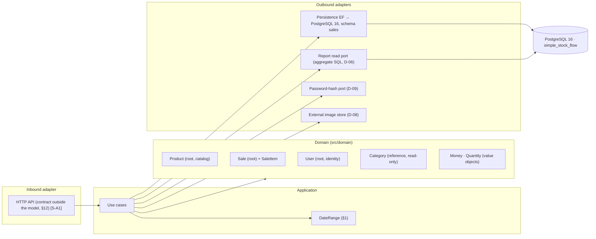

# Architecture — Simple Stock Flow

> **Step 1 of 6** of the challenge (documentation is rebuilt backwards: architecture → requirements → product → domain → context → closure).
> **Single source:** [`spec/data-model.md`](../spec/data-model.md) (written in Spanish; quotes below are translated).
>
> **How to read the citations.** `§n` = section of the data model · `FK-n`, `D-nn`, `DP-nn`, `T-nn`, `Qn`, `ADR-nnn`, `A-n` = identifiers the model itself mentions ·
> **`[S-An]`** = **assumption**: it does not come from the model and is declared in [§10](#10-assumptions).
> The model marks every rule as **engine** (enforced by PostgreSQL now), **domain only** (enforced by C# only) or **pending (T-xx)**.

---

## 1. What the model says about the shape of the system

The model is a storage document, but it leaves explicit hints about the architecture around it:

| Evidence in the model | Citation | Architectural implication |
|---|---|---|
| "Translating from one to the other is the responsibility of the **persistence adapter**" | §0 | Persistence sits behind an adapter; the domain knows nothing about tables |
| "if the constraint fires, **something wrote outside the adapter**" | §0 (ADR-002) | All legitimate data access goes through the adapter; the database is the last barrier |
| "computed in the engine through a **read port** (D-06)" | §1 (Sales report) | The report is a separate read model, not an aggregate |
| "The hash is produced by a **port** (D-09)" · "by design of the **hexagon**" | §2.5, §9.2 | Explicit **hexagonal** style; cryptography is a port |
| Folders `src/domain/` and `src/adapters/outbound/persistence/Configurations/` | §12 | Domain and outbound adapters live in different folders |
| "no port creates, renames or deletes categories" · "there is no edit or delete port" (sale) | §2.1, §2.3 | Capabilities are defined by the **presence or absence of ports** |
| `DateRange` is a "value object of the **application layer**" | §1 | An application layer exists between the entry point and the domain |
| Image binary in "external storage"; the domain keeps only a key (D-08) | §1, §7.1 | An external system outside the database |
| The admin account is "created by the **application start-up**" from environment credentials | §9.2 | There is a *bootstrap* step in the application |
| Repositories `simple-stock-flow-api`, `simple-stock-flow-infra`, `simple-stock-flow-docs`; `DbSet<Product>`, C# classes, EF | §0, §10, §12 | C# backend with EF Core; infrastructure and documentation in separate repos |

## 2. Architectural style

**Hexagonal architecture (ports and adapters) with tactical domain design (aggregates, value objects).**
The domain (`src/domain/`) is the core and holds the rules; everything outbound (database, hashing, image storage, report query) sits behind a port.

## 3. Building blocks and responsibilities

| Block | Responsibility | Citation |
|---|---|---|
| **Domain** | Business invariants: `Product.Rename/ChangePrice/Withdraw/Restock/SetCategory/AttachImage`, `Sale.AddItem/EnsureConfirmable`, `Category.Rename`, `User.NormalizeUsername`, `Roles.IsValid`, `Money`, `Quantity` | §2.1–§2.5 |
| **Application** | Orchestrates use cases and carries `DateRange` (end ≥ start) | §1 |
| **Category repository** | **Read-only**; starts with 5 seeded rows | §2.1, §9.1 |
| **Product repository** | Paged search (Q1), by id (Q2), by batch of active ids (Q3) | §6.1 |
| **Sale repository** | Sale with lines (Q6), sales by range, paged (Q7). **No edit, no delete** | §2.3, §6.1 |
| **User repository** | User by exact name (Q10) | §6.1 |
| **Report read port** | Aggregates in the engine by product and range (Q9); persists nothing | §1, §6.1, D-06 |
| **Hash port** | The only place that produces/verifies `password_hash` | §2.5, §9.2 |
| **Image port** | Stores/deletes the binary; the domain only knows `image_key` | §1, §7.1 · port name **[S-A4]** |
| **Persistence adapter (EF)** | Maps objects ↔ tables, translates plural (C# collections) ↔ singular (tables), exposes `xmin` and `deleted_at` as shadow properties | §0, §3, D-03, D-04 |
| **Bootstrap** | Creates the initial administrator from environment variables | §9.2 |

## 4. Aggregates and consistency boundaries

| Root | Contains | Boundary | Citation |
|---|---|---|---|
| `Product` (catalog) | `Money`; reference to `Category` **by identity** | Stock and price change only through its methods | §2.2 |
| `Sale` (sales) | `SaleItem` (`internal` constructor; only `Sale.AddItem` creates it) | A persistable sale = ≥1 line; withdrawing stock and adding the line are **a single operation** | §2.3, §2.4 |
| `User` (identity) | — | Username uniqueness and normalization | §2.5 |
| `Category` | — | **Not a root** and has no life cycle | §2.1 |

Crossings between aggregates are **by root identity** (§5, cardinality table): `sale_item → product`, `sale → user`, `product → category`.

## 5. Where each rule lives (the central axis of the model)

The model tags every rule with three marks (§How to read this document). Operational summary for implementers:

| Mark | Rules | Citation |
|---|---|---|
| **engine** | PK of the 5 tables · unique `category.name` · unique `user.username` · `stock >= 0` (`ck_product_stock_non_negative`) · FK-1 `RESTRICT` · FK-2 `CASCADE` · FK-3 `RESTRICT` · `sale_item.sale_id NOT NULL` · unique `(sale_id, product_id)` with `INCLUDE (quantity, unit_price)` · `deleted_at` + global filter | §2, §4, §5, §13 (D-1, D-2) |
| **domain only** | `price > 0` · `quantity > 0` · non-empty, trimmed names · `role ∈ {admin, seller}` · lowercase username · ≥1 line per sale · withdrawing more stock than available fails · `AddItem` = `Withdraw` + line · frozen name and price · sale immutability · `Money` rounding | §2, §4 |
| **pending** | `sale.sold_by_user_id` + FK-4 and rename `sold_by → sold_by_username` (T-12) · frozen `category_name` (T-11) · three access indexes and `pg_trgm` (T-13) · pushing the CHECKs for `price`, `quantity`, `category.name`, `role` and lowercase down to the engine (T-20) | §3, §4, §6.2 |

> **Design consequence.** While a rule is *domain only*, "a manual `INSERT` through `psql` skips it silently" (§How to read this document). The architecture must treat those rules as **protected only if every access goes through the adapter**.

## 6. Decisions the model cites (the content of the ADRs was **not** delivered)

Only what the model says about each one is stated:

| Decision | What it fixes according to the model | Citation |
|---|---|---|
| ADR-001 | The schema is owned by the **EF migrations** and nothing else; all DDL (including `CREATE EXTENSION`) goes there | §3.2, §6.2 |
| ADR-002 / D-04 | **Optimistic** concurrency; `stock >= 0` is the last barrier; `xmin` is the concurrency token | §0, §2.2, §3 |
| ADR-003 / D-03 | **Soft delete** of products with `deleted_at` as a shadow property; FK-3 as last-resort barrier | §2.2, §5 |
| ADR-004 / D-06 | **Aggregate report in the engine** over **frozen** values (`category_name` with no FK on purpose) | §3, §6.1, §11.1 |
| D-05 | **Single currency**: no currency column in any table | §1, §3 |
| D-07 | Value objects **without a table**; they live in their owner's row | §2 |
| D-08 | Image = **opaque key** to an external binary; never a path or bytes | §1, §7.1 |
| D-09 | The hash is produced by a **port**; the domain never sees the clear-text password | §1, §2.5 |
| D-10 | **Five fixed categories**, seeded; the initial admin comes from the environment | §1, §9 |

## 7. Data and environment

- **Engine:** PostgreSQL 16 (verified on 16.14), database `simple_stock_flow`, schema `sales` (§Verified against). Server in **UTC**; every timestamp is `timestamptz` (§3).
- **Five tables, singular** (`category`, `product`, `sale`, `sale_item`, `user`); the schema is still called `sales` (§0).
- **No column has a `DEFAULT`**: values are set by the domain (§3). That is also why there are no `created_at`/`updated_at` columns (§8).
- **Applied migrations:** four (`InitialSchema`, `StockNonNegative`, `AccentSeedCategoryNames`, `RenameTablesToSingular`) (§3.2).
- **Infrastructure:** container `simple-stock-flow-db-1` started from `simple-stock-flow-infra` with `docker compose` (§10).
- **Indexes:** those required by access pattern (§6.1) — the missing ones are in T-13 (§6.2). `pg_trgm` is installed by **the very migration** that creates the trigram index (§6.2).

## 8. Critical flows

**8.1 Register a sale**
1. Read products by batch of ids, active only (**Q3**, "contention point of D-04", §6.1).
2. For each line: `Sale.AddItem` calls `Product.Withdraw` and copies the frozen name, price and category (§2.3, §2.4).
3. `Sale.EnsureConfirmable` requires ≥1 line (§2.3).
4. Persist sale and lines; the `xmin` column detects concurrent writes and `ck_product_stock_non_negative` is the last barrier (§2.2, §3).
5. What happens on a concurrency conflict (retry vs. error) is **not stated by the model** **[S-A3]**.

**8.2 Sales report.** A single read port runs Q9 over `sale ⋈ sale_item`, groups by `product_id, product_name, category_name` and sorts by amount descending; with the unique index with `INCLUDE`, it does not touch the table (§6.1, §6.2, §11.1).

**8.3 Replace or discontinue an image.** First `image_key` is set to null and the transaction is committed; **only then** the binary is deleted. There is no atomicity between the two and none is promised (§7.1).

**8.4 Authentication.** Look up the user by exact name (Q10, high frequency) → verify against `password_hash` **only** through the hash port (§2.5, §7).

**8.5 Start-up.** If it does not exist, the *bootstrap* creates the administrator with environment credentials (§9.2).

## 9. Architectural risks the model itself acknowledges

| # | Risk | Citation |
|---|---|---|
| R-1 | *Domain-only* rules are skipped by `psql`, migrations or future services | §How to read this document |
| R-2 | `Money(0)` is valid; `price > 0` is guarded only by `Product.ChangePrice` | §2.2 |
| R-3 | Every `NOT NULL` migration is **free today and expensive after the first sale** | §10.4 |
| R-4 | Q8 (sales by range, unpaged) has no consumer: a "trap" if left in the port | §6.1 |
| R-5 | Orphan binaries if the second step of deletion fails; no cleanup process (H-2) | §7.1, §11 |
| R-6 | Index-only scans depend on the visibility map; on an insert-only table they may read the table | §6.3 |
| R-7 | Authorization (who grants `admin`) lives in the API, outside the model | §9.2, §13 (D-3) |

## 10. Assumptions

| ID | Assumption | Reason |
|---|---|---|
| S-A1 | The entry point is an **HTTP API**. | The model mentions 401/403 responses (§13) and an "API contract" (§12) but not the protocol |
| S-A2 | Use cases form their own "Application" layer. | Inferred from `DateRange` being in the application layer (§1) |
| S-A3 | A concurrency conflict (`xmin`) is **rejected with an error** to the client, with no automatic retry. | ADR-002 was not delivered |
| S-A4 | The image store is modeled as an **outbound port**. | D-08 only speaks of "external storage" |
| S-A5 | Authentication yields a token that identifies user and role. | 401 "without token" (§13) but the mechanism is not defined |
